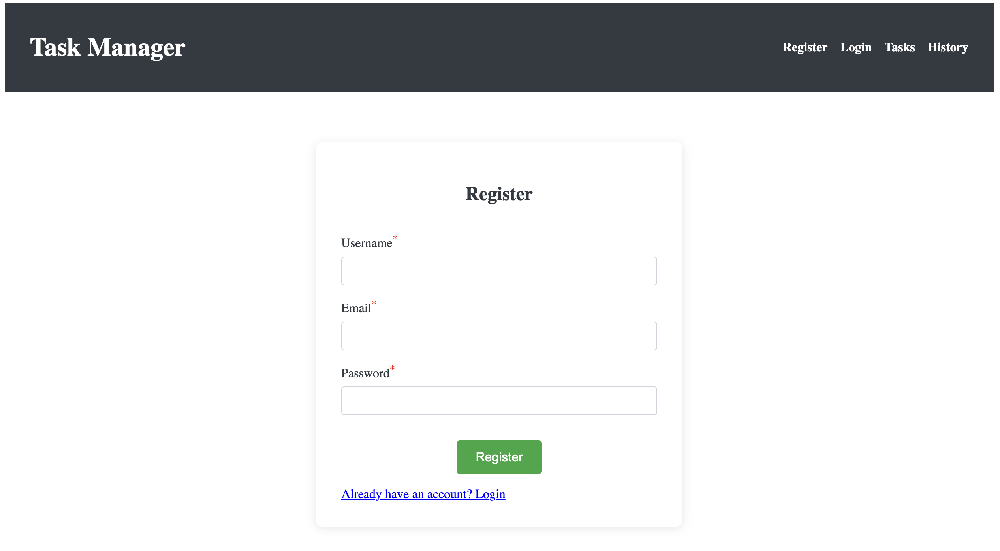

# 📝 Task Manager App (Built with Ember.js)

This project is part of my Ember.js learning journey. Built with attention to reusability, routing, and frontend logic using modern Ember practices.

This is a simple Task Manager web application built using Ember.js. It allows users to:

- Log in (planned)

- View all tasks

- View individual task details

- Create a new task

- Edit an existing task

- Delete a task

- View the history of changes (coming soon)

## 🚀 Getting Started

1. Install Ember CLI
```bash
npm install -g ember-cli
```
2. Create the Project
```bash
ember new task-manager
cd task-manager
```
3. Add Ember Mirage for Mock API
```bash
ember install ember-cli-mirage
```
Mirage is used to simulate API calls during development.

## 📁 Project Structure Overview

- app/templates/ – contains route-based templates

- app/components/ – reusable UI components

- app/routes/ – route logic and data fetching

- app/controllers/ – stores local state for forms

- mirage/ – fake backend using Mirage

- scenarios/ – seed data for development

- serializers/ – control how Mirage returns data

## ✅ Features Completed

1. Routing & Templates

    * <code>/tasks</code> – view task list

    * <code>/tasks/:id</code> – view task detail

    * <code>/tasks/new</code> – create a new task

    * <code>/tasks/:id/edit</code> – edit a task

2. Reusable Form Component

    * <code>```<TaskForm/>```</code> used for both Create and Edit task

    * Takes <code>title, description, status</code> as arguments

    * Emits <code>onSubmit, onTitleChange, etc</code>.

3. Mock Backend (Mirage)

    * <code>GET /api/tasks</code> – get all tasks

    * <code>GET /api/tasks/:id</code> – get task detail

    * <code>POST /api/tasks</code> – create new task

    * <code>PATCH /api/tasks/:id</code> – update task

    * <code>DELETE /api/tasks/:id</code> – delete task

4. TaskCard Component

    * Displays individual task nicely in list

5. Form Validations

    * Added validations for Login, Register, Add a new task, and Edit task forms. Utilized Ember's handlebars to display the errors.

6. Testing

    * Acceptance Tests
        - Added acceptance tests for adding a new task form
        - Added acceptance tests for editing the task form

## 📸 Screenshots

Below are some of the screenshots from the website UI.

* Note: Some of the styling and functionality is yet to be added for pages like tasks, history

### Register page


### Login page


### Add a new task form


### Edit task page


## 🧠 Key Learnings

* Difference between routes, templates, and components in Ember

* How to reuse form code via components

* How query params and refreshModel can re-trigger model hooks

* How Mirage helps simulate a real backend

* How to handle navigation using <code>@service</code> router

## 🔜 Next Steps (Planned)

🧩 1. Track Task Change History

  * Log and display changes (old vs new values)

  * Show history per task below task detail

👤 2. Add Login Functionality

  * Use session or token simulation

  * Only show tasks for logged-in users

🛡️ 3. Add Validation & Error Handling

  * Prevent empty fields

  * Show loading & error messages

💾 4. Replace Mirage with Real API

  * Use Express/FastAPI backend later

🎨 5. Add CSS Styling

  * Use global CSS for layout and colors

  * Add responsive styles for mobile


